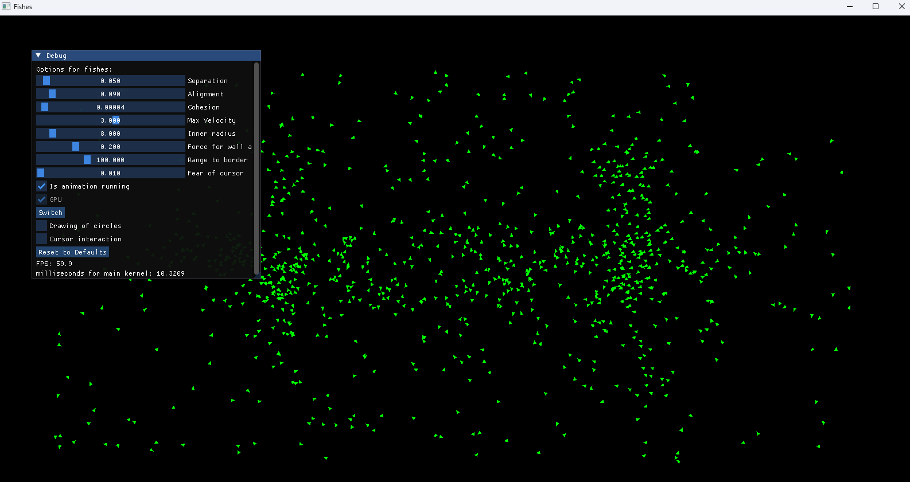
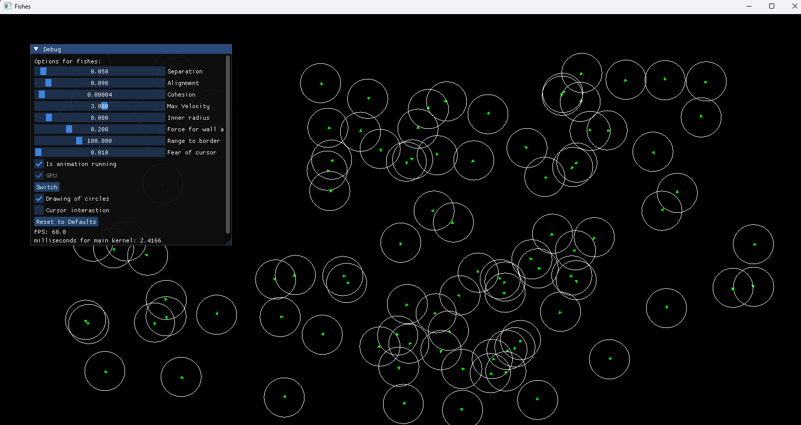

# CUDA Fish Simulation

A real-time fish simulation leveraging CUDA for high-performance computations and OpenGL for rendering. The simulation models the behavior of fish in an interactive environment using ImGui for real-time parameter tuning.

## Features
- **CUDA Acceleration**: Utilizes NVIDIA CUDA for parallel processing of fish movement and interactions.
- **OpenGL Rendering**: Uses OpenGL for efficient rendering of the fish and environment.
- **ImGui Integration**: Provides an interactive UI for adjusting simulation parameters.
- **GLFW Window Management**: Handles window creation and user input.

## Controls
- `Space`: Pause/Resume simulation
- `C`: Toggle fish vision range visualization
- `G`: Switch between CPU and GPU computation
- `F`: Enable "Fear Mode" (move cursor to scare fish)

